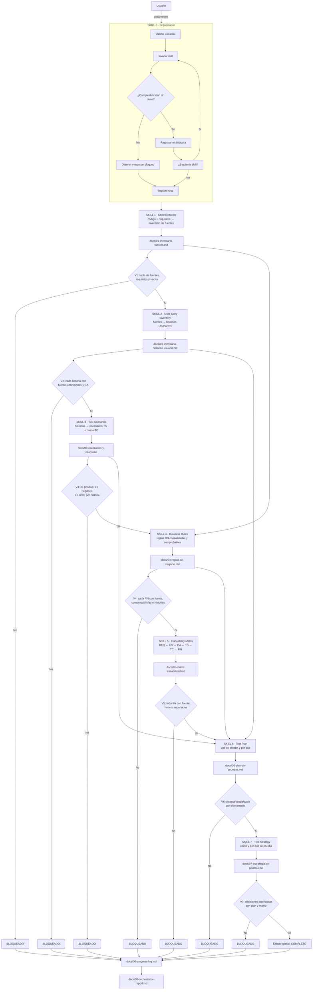

# Sistema de Skills de QA Asistido por IA

Ocho skills encadenadas que transforman el **código fuente** de una tienda PrestaShop en un **plan y una estrategia de pruebas** totalmente trazables, sin inventar funcionalidades.

Las definiciones viven en `ai/skills/<NN>-<nombre>/SKILL.md`. Los prompts operativos que las invocan están en `ai/system-prompts/`.

---

## Principios inviolables

Aplican a **todas** las skills, sin excepción:

| # | Principio | Qué significa en la práctica |
| :--- | :--- | :--- |
| 1 | **Formato único** | Toda salida es Markdown puro. Nunca JSON, YAML, XML ni texto sin estructura. |
| 2 | **Cero invención** | Nada entra sin respaldo en código real, requisitos del usuario o evidencia. |
| 3 | **Trazabilidad obligatoria** | Toda afirmación cita su fuente: `[FUENTE: ruta:línea]`, `[FUENTE: requisito del usuario, fecha]` o `[FUENTE: docs/...]`. Sin fuente → `[SIN FUENTE – PENDIENTE DE VALIDAR]` y fuera del inventario. |
| 4 | **Sin asumir comportamiento** | Ante ambigüedad en el código, la skill se detiene y pregunta. No rellena con suposiciones. |
| 5 | **Idioma** | Español, salvo rutas, identificadores y términos técnicos. |
| 6 | **Versionado** | Cada artefacto lleva encabezado con `artifact`, `version`, `generated_by`, `date` y `sources`. |

### Convenciones de identificadores

`REQ-XXX` requisito · `FUENTE-XXX` fuente de código · `US-XXX` historia de usuario · `CA-XXX` criterio de aceptación · `RN-XXX` regla de negocio · `TS-XXX` escenario · `TC-XXX` caso de prueba.

### Marcas de estado

`[FUENTE: ...]` · `[SIN FUENTE]` · `[BLOQUEADO: ...]` · `[PENDIENTE DE VALIDAR]` · `[SUPUESTO: ...]` · `⚠️` sin cobertura · `✅` cubierto.

---

## Flujo completo



Los puntos `V1`–`V7` son las validaciones de *definition of done*. Si una falla, el flujo se detiene: **no se avanza y no se rellena el hueco**.

---

## Mapa de skills

| # | Skill | Entrada principal | Salida |
| :--- | :--- | :--- | :--- |
| 0 | `00-orchestrator` | Parámetros del usuario | `docs/00-progress-log.md`, `docs/00-orchestrator-report.md` |
| 1 | `01-code-extractor` | Código fuente + requisitos (opcional) | `docs/01-inventario-fuentes.md` |
| 2 | `02-user-story-inventory` | `docs/01-inventario-fuentes.md` | `docs/02-inventario-historias-usuario.md` |
| 3 | `03-test-scenarios` | `docs/02-inventario-historias-usuario.md` | `docs/03-escenarios-y-casos.md` |
| 4 | `04-business-rules` | `docs/01`, `docs/02` | `docs/04-reglas-de-negocio.md` |
| 5 | `05-traceability-matrix` | `docs/01`, `docs/02`, `docs/03`, `docs/04` | `docs/05-matriz-trazabilidad.md` |
| 6 | `06-test-plan` | `docs/02`, `docs/03`, `docs/04`, `docs/05` | `docs/06-plan-de-pruebas.md` |
| 7 | `07-test-strategy` | `docs/06`, `docs/05` | `docs/07-estrategia-de-pruebas.md` |

Detalle de entradas, salidas, reglas, plantilla y *definition of done* de cada skill: `ai/skills/<NN>-<nombre>/SKILL.md`.
Orden de ejecución, dependencias y puntos de validación: [`ai/skills/00-orchestrator/flow.md`](00-orchestrator/flow.md).

---

## Cómo ejecutar

| Objetivo | Prompt a usar |
| :--- | :--- |
| Generar este sistema de skills (ya hecho) | `ai/system-prompts/00-bootstrap-skills.prompt.md` |
| Ejecutar el flujo completo (SKILL 1 → 7) | `ai/system-prompts/01-run-orchestrator.prompt.md` |
| Ejecutar una única skill | `ai/system-prompts/02-run-single-skill.prompt.md` |

### Parámetros del orquestador

| Parámetro | Descripción | Por defecto |
| :--- | :--- | :--- |
| `PROJECT_ROOT` | Ruta del código a analizar | `./` |
| `DOCS_DIR` | Carpeta de artefactos | `./docs/` |
| `EVIDENCE_DIR` | Carpeta de evidencias | `./evidence/` |
| `REQUIREMENTS_FILE` | Requisitos explícitos (opcional) | `null` |
| `START_SKILL` | Skill inicial | `1` |
| `STOP_SKILL` | Skill final | `7` |
| `DRY_RUN` | Simula sin escribir artefactos | `false` |
| `STRICT_MODE` | Detiene el flujo ante cualquier falta de fuente | `true` |
| `OVERWRITE` | Sobrescribe la salida existente (modo single-skill) | `false` |

---

## Estructura de carpetas

```text
ai/
├── skills/                          # Este sistema de skills
│   ├── README.md
│   ├── 00-orchestrator/
│   │   ├── SKILL.md
│   │   └── flow.md
│   ├── 01-code-extractor/SKILL.md
│   ├── 02-user-story-inventory/SKILL.md
│   ├── 03-test-scenarios/SKILL.md
│   ├── 04-business-rules/SKILL.md
│   ├── 05-traceability-matrix/SKILL.md
│   ├── 06-test-plan/SKILL.md
│   └── 07-test-strategy/SKILL.md
├── system-prompts/                  # Prompts operativos
│   ├── 00-bootstrap-skills.prompt.md
│   ├── 01-run-orchestrator.prompt.md
│   └── 02-run-single-skill.prompt.md
├── clients/                         # Cliente LLM y mock
├── mocks/
├── prompts/
└── services/

docs/                                # Artefactos generados por las skills
├── 00-progress-log.md
├── 00-orchestrator-report.md
├── 01-inventario-fuentes.md
├── 02-inventario-historias-usuario.md
├── 03-escenarios-y-casos.md
├── 04-reglas-de-negocio.md
├── 05-matriz-trazabilidad.md
├── 06-plan-de-pruebas.md
└── 07-estrategia-de-pruebas.md

evidence/                            # Evidencias: screenshots, videos, CI, reports
reports/                             # Reportes de ejecución: html, junit, ai-analysis
```

---

## Estado actual

Las skills están **definidas pero no ejecutadas**. Todos los artefactos en `docs/` son *placeholders*: contienen el encabezado y la marca `Pendiente por generar`, sin contenido inventado.

Para pasar de infraestructura a contenido, ejecuta [`ai/system-prompts/01-run-orchestrator.prompt.md`](../system-prompts/01-run-orchestrator.prompt.md) o invoca la SKILL 1 directamente.
