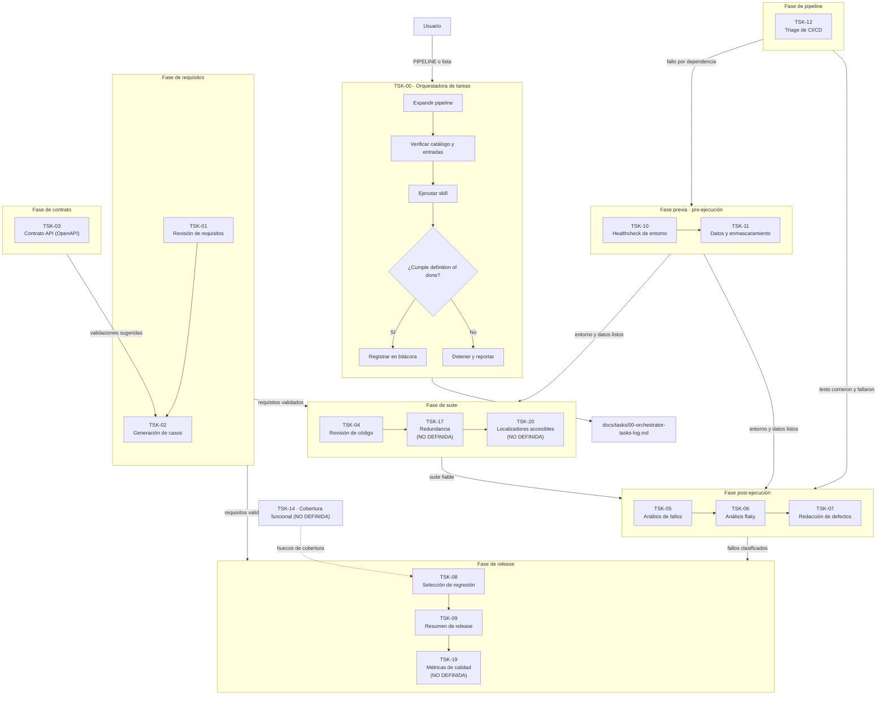

# Skills de Tareas Repetitivas de QA (TSK-XX)

Trece skills que automatizan el trabajo diario de un QA Engineer: revisar requisitos, generar casos, auditar un contrato API, revisar el código de automatización, analizar fallos, detectar tests inestables, redactar bugs, seleccionar regresión, resumir el release, verificar el entorno, generar datos de prueba y hacer triage de CI.

Las definiciones viven en `ai/skills/tasks/<ID>-<nombre>/SKILL.md`. Los prompts operativos que las invocan están en `ai/system-prompts/`.

> Este sistema es **independiente** del de `ai/skills/` (SKILL 00–07). Aquel extrae requisitos desde el código; este opera sobre los artefactos de QA ya existentes: historias, casos, reportes, logs, contratos y código de test. Se complementan, no se solapan.

---

## Principios inviolables

Aplican a **todas** las `TSK-XX`, sin excepción:

| # | Principio | Qué significa en la práctica |
| :--- | :--- | :--- |
| 1 | **Formato único** | Toda salida es Markdown puro. Nunca JSON, YAML, XML ni texto sin estructura. |
| 2 | **Cero invención** | Nada entra sin respaldo en la entrada. Lo que no existe se marca `[PENDIENTE DE VALIDAR]` o `[SIN FUENTE]`. |
| 3 | **Trazabilidad obligatoria** | Toda afirmación cita su fuente: `[FUENTE: ruta:línea]`, `[FUENTE: docs/...#US-012]`, `[FUENTE: json-pointer]`. |
| 4 | **Aislamiento** | Cada skill opera sobre su entrada y escribe solo su salida. No toca artefactos de otras. |
| 5 | **Idempotencia** | Dos ejecuciones sobre la misma entrada producen el mismo resultado. |
| 6 | **Idioma** | Español, salvo nombres de archivo, rutas, identificadores y términos técnicos. |
| 7 | **Versionado** | Cada artefacto lleva encabezado con `artifact`, `version`, `generated_by`, `date` y `sources`. |

### Convenciones de identificadores

`BUG-XXX` defecto · `TS-XXX` escenario · `TC-XXX` caso de prueba · `HALL-XXX` hallazgo · `EXP-XXX` exposición de datos · `API-NXX` caso negativo de API.

### Marcas de estado

`[FUENTE: ...]` · `[SIN FUENTE]` · `[BLOQUEADO: ...]` · `[PENDIENTE DE VALIDAR]` · estados de etapa: `OK` / `FALLO` / `BLOQUEADO` / `OMITIDA` / `NO DEFINIDA`.

---

## Catálogo completo



Los nodos marcados `NO DEFINIDA` pertenecen a pipelines predefinidos pero **no tienen `SKILL.md`**: se registran como etapa `NO DEFINIDA` en la bitácora y nunca se sustituyen por una tarea parecida.

---

## Pipelines predefinidos

| Pipeline | Secuencia | Resultado |
| :--- | :--- | :--- |
| `pre-ejecución` | `TSK-10` → `TSK-11` | Entorno verificado y plan de datos aislado antes de correr la suite |
| `nueva-historia` | `TSK-01` → `TSK-02` → `TSK-14` ⚠️ | Hallazgos de requisitos, casos generados y cobertura funcional (`TSK-14` no definida) |
| `revision-suite` | `TSK-04` → `TSK-17` → `TSK-20` ⚠️ | Antipatrones, redundancia y accesibilidad de localizadores (`TSK-17` y `TSK-20` no definidas) |
| `post-ejecución` | `TSK-05` → `TSK-06` → `TSK-07` | Fallos clasificados, ranking de flakiness y fichas de bug |
| `pre-release` | `TSK-08` → `TSK-09` → `TSK-19` ⚠️ | Plan de regresión, veredicto go/no-go y métricas (`TSK-19` no definida) |

⚠️ = el pipeline contiene al menos una etapa sin skill definida. La orquestadora lo ejecuta hasta la última etapa válida y registra el resto como `NO DEFINIDA`.

---

## Mapa de skills

| ID | Nombre | Entrada principal | Salida |
| :--- | :--- | :--- | :--- |
| 00 | `00-orchestrator-tasks` | Nombre de pipeline o lista de `TSK-XX` | `docs/tasks/00-orchestrator-tasks-log.md` |
| 01 | `TSK-01-revision-requisitos` | `docs/02-inventario-historias-usuario.md` | `docs/tasks/TSK-01-revision-requisitos.md` |
| 02 | `TSK-02-casos-de-prueba` | `docs/02-inventario-historias-usuario.md`, `docs/04-reglas-de-negocio.md` | `docs/tasks/TSK-02-casos-de-prueba.md` |
| 03 | `TSK-03-contrato-api` | Archivo OpenAPI + endpoints de interés | `docs/tasks/TSK-03-contrato-api.md` |
| 04 | `TSK-04-revision-codigo-automatizacion` | `tests/**/*.spec.ts`, `pages/*.ts`, `fixtures/*.ts` | `docs/tasks/TSK-04-revision-codigo-automatizacion.md` |
| 05 | `TSK-05-analisis-fallos` | Reporte HTML/JUnit, logs, capturas | `docs/tasks/TSK-05-analisis-fallos.md` |
| 06 | `TSK-06-analisis-flaky` | Histórico de ≥3 ejecuciones (JUnit) | `docs/tasks/TSK-06-analisis-flaky.md` |
| 07 | `TSK-07-defectos` | Logs, capturas, respuestas de API | `docs/tasks/TSK-07-defectos/BUG-XXX.md` + índice |
| 08 | `TSK-08-seleccion-regresion` | Diff de código, tests, histórico de defectos | `docs/tasks/TSK-08-seleccion-regresion.md` |
| 09 | `TSK-09-resumen-release` | Reportes de ejecución, estado de defectos, riesgos | `docs/tasks/TSK-09-resumen-release.md` |
| 10 | `TSK-10-healthcheck-entorno` | `playwright.config.ts`, URL base, credenciales | `docs/tasks/TSK-10-healthcheck-entorno.md` |
| 11 | `TSK-11-datos-prueba` | `docs/04-reglas-de-negocio.md`, fixtures, logger | `docs/tasks/TSK-11-datos-prueba.md` |
| 12 | `TSK-12-triage-ci` | Log del pipeline + workflow de CI | `docs/tasks/TSK-12-triage-ci.md` |

Detalle de entradas, salidas, reglas, plantilla y *definition of done* de cada skill: `ai/skills/tasks/<ID>-<nombre>/SKILL.md`.

---

## Cómo ejecutar

| Objetivo | Prompt a usar |
| :--- | :--- |
| Generar este sistema de skills (ya hecho) | `ai/system-prompts/03-bootstrap-qa-task-skills.prompt.md` |
| Ejecutar una única `TSK-XX` | `ai/system-prompts/04-run-task-skill.prompt.md` |
| Ejecutar un pipeline completo | `ai/system-prompts/05-run-task-pipeline.prompt.md` |

### Parámetros del orquestador

| Parámetro | Descripción | Por defecto |
| :--- | :--- | :--- |
| `PIPELINE` | Nombre del pipeline a ejecutar | — |
| `SKILL_LIST` | Lista explícita de `TSK-XX`, en orden | `null` |
| `PROJECT_ROOT` | Raíz del proyecto | `./` |
| `DOCS_TASKS_DIR` | Carpeta de artefactos de tareas | `./docs/tasks/` |
| `EVIDENCE_TASKS_DIR` | Carpeta de evidencias de tareas | `./evidence/tasks/` |
| `DRY_RUN` | Simula sin escribir artefactos | `false` |
| `STRICT_MODE` | Detiene el flujo ante `[SIN FUENTE]` | `true` |
| `OVERWRITE` | Sobrescribe salidas existentes | `false` |
| `STOP_ON_FAILURE` | Detiene el pipeline en la primera skill que falle | `true` |

---

## Estructura de carpetas

```text
ai/
├── skills/
│   ├── 00-orchestrator/ … 07-test-strategy/   # Sistema de extracción (SKILL 00–07)
│   └── tasks/                                # Este sistema (TSK-XX)
│       ├── README.md
│       ├── 00-orchestrator-tasks/SKILL.md
│       ├── TSK-01-revision-requisitos/SKILL.md
│       ├── TSK-02-casos-de-prueba/SKILL.md
│       ├── TSK-03-contrato-api/SKILL.md
│       ├── TSK-04-revision-codigo-automatizacion/SKILL.md
│       ├── TSK-05-analisis-fallos/SKILL.md
│       ├── TSK-06-analisis-flaky/SKILL.md
│       ├── TSK-07-defectos/SKILL.md
│       ├── TSK-08-seleccion-regresion/SKILL.md
│       ├── TSK-09-resumen-release/SKILL.md
│       ├── TSK-10-healthcheck-entorno/SKILL.md
│       ├── TSK-11-datos-prueba/SKILL.md
│       └── TSK-12-triage-ci/SKILL.md
└── system-prompts/
    ├── 00-bootstrap-skills.prompt.md
    ├── 01-run-orchestrator.prompt.md
    ├── 02-run-single-skill.prompt.md
    ├── 03-bootstrap-qa-task-skills.prompt.md
    ├── 04-run-task-skill.prompt.md
    └── 05-run-task-pipeline.prompt.md

docs/
├── 01…07-*.md                # Artefactos de las SKILL 00–07
└── tasks/                     # Artefactos de las TSK-XX
    ├── 00-orchestrator-tasks-log.md
    ├── TSK-01-revision-requisitos.md
    ├── …
    └── TSK-07-defectos/BUG-XXX.md

evidence/
├── ci/  reports/  screenshots/  videos/
└── tasks/                      # Evidencias de las TSK-XX
    ├── TSK-05/  TSK-07/  TSK-10/  TSK-12/
```

---

## Estado actual

Las skills están **definidas pero no ejecutadas**. `docs/tasks/` y `evidence/tasks/` están vacíos: solo contienen `.gitkeep`. Ningún artefacto de este sistema existe todavía, y por lo tanto **no hay nada inventado**.

Para empezar, ejecuta [`ai/system-prompts/05-run-task-pipeline.prompt.md`](../../system-prompts/05-run-task-pipeline.prompt.md) con el pipeline que necesites.
